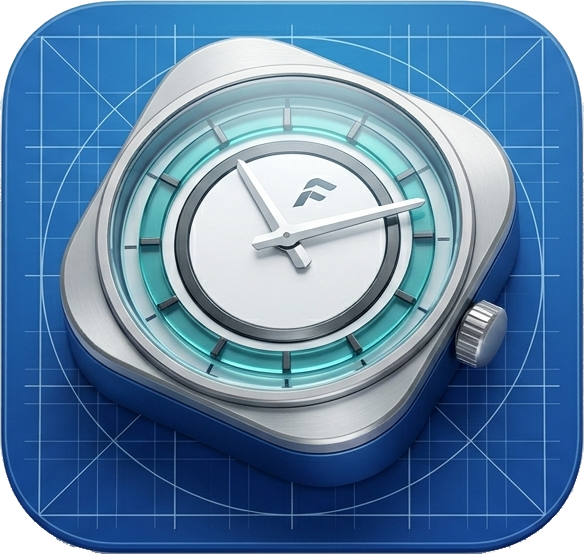
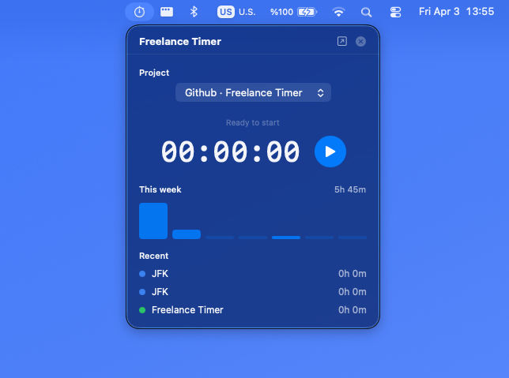
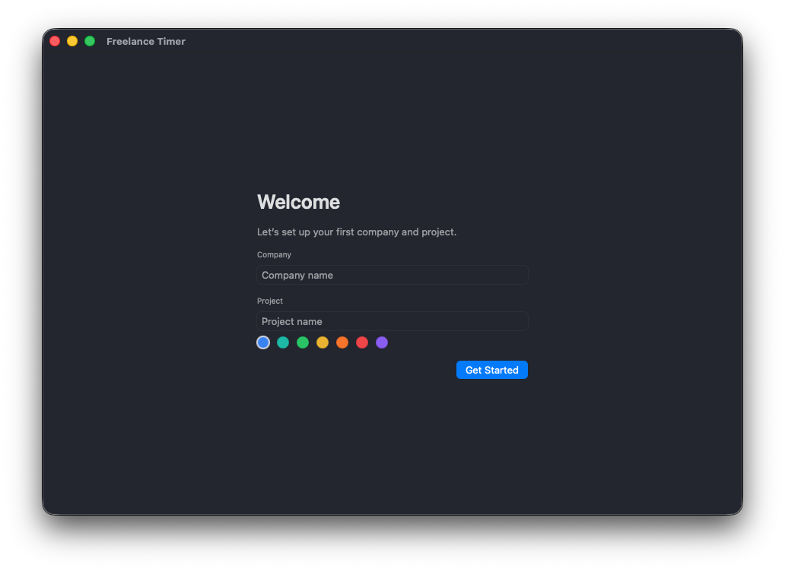
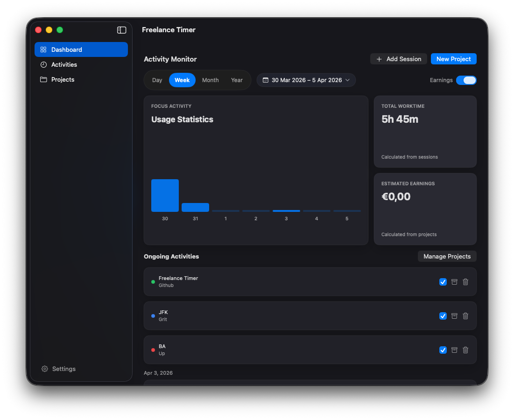

  
  <h1>Freelance Timer</h1>
  
<strong>A minimal macOS menubar app to track freelance work sessions with projects, summaries, and local-only storage.</strong>

  

    <a href="#features">Features</a> •
    <a href="#screenshots">Screenshots</a> •
    <a href="#getting-started">Getting Started</a> •
    <a href="#usage">Usage</a> •
    <a href="#data-management">Data Management</a> •
    <a href="#tech-stack">Tech Stack</a>
  

  

    
    
    
    
  

## Screenshots

### Screenshot Guide

**Best option (recommended):** macOS Screenshot tool  
1. Launch the app from Xcode so it runs in Debug.
2. Arrange the menubar popover or main window.
3. Press `Shift + Command + 4` (or `Shift + Command + 5` for the full HUD).
4. Save into `screenshots/` with the names above.

**Xcode option:**  
Xcode doesn’t have a dedicated macOS UI screenshot tool like iOS Simulator. The most reliable workflow is still the macOS Screenshot tool while the app is running from Xcode.

## Features

- Menubar dashboard with live timer, quick actions, and recent sessions
- Project + company management with color tags
- Hourly rate and optional monthly retainer per project
- Earnings toggle with currency selection
- Manual session entry and editable sessions
- Current / previous Day, Week, Month, Year summaries with charts
- Project detail view with stats + session list
- First-run onboarding
- Local Core Data storage (offline-first)
- CSV export and full data reset
- Backup export + import (JSON) with merge/replace options

## Getting Started

### Requirements
- macOS 13+
- Xcode 15+

### Run Locally
1. Open `Freelance Timer.xcodeproj` in Xcode.
2. Select **My Mac** as the destination.
3. Build & Run.

## Usage

1. Complete onboarding (create your first company + project).
2. Set your currency in `Settings`.
3. Start the timer from the menubar.
4. Pause or finish when you’re done.
5. Use the main window to view summaries, edit sessions, or manage projects.

## Data Management

- **Export CSV:** `Settings → Export CSV…`
- **Export Backup:** `Settings → Export Backup…`
- **Import Backup:** `Settings → Import Backup…` (Replace or Merge)
- **Reset All Data:** `Settings → Reset All Data…`

## Download DMG

**Latest release:** `v0.1.0`  
[Download DMG](https://github.com/hasanharman/freelance-timer/releases/download/v0.1.0/Freelance-Timer.dmg)

## Tech Stack

- Swift 5.9
- SwiftUI
- Core Data
- Charts

## Logo & Assets

- App icon assets live in `Freelance Timer/Assets.xcassets/AppIcon.appiconset`.
- Place a 1024×1024 logo PNG at `screenshots/logo.png` for the README header.
